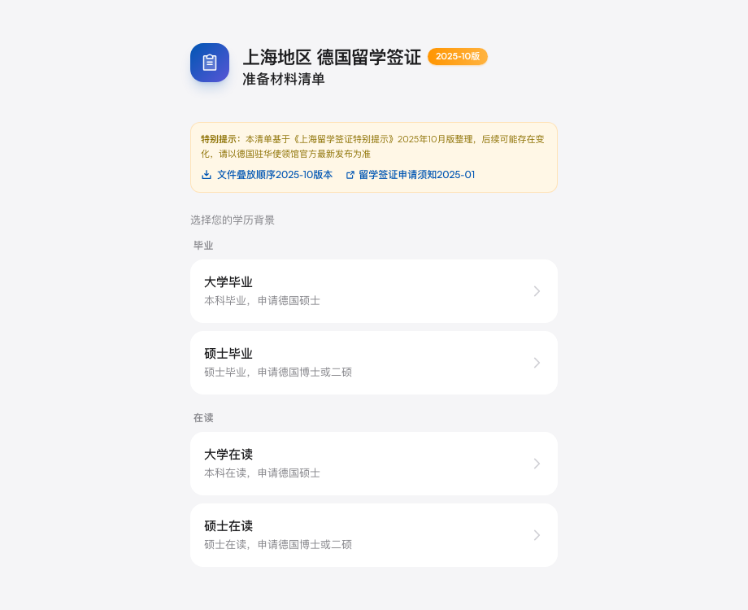
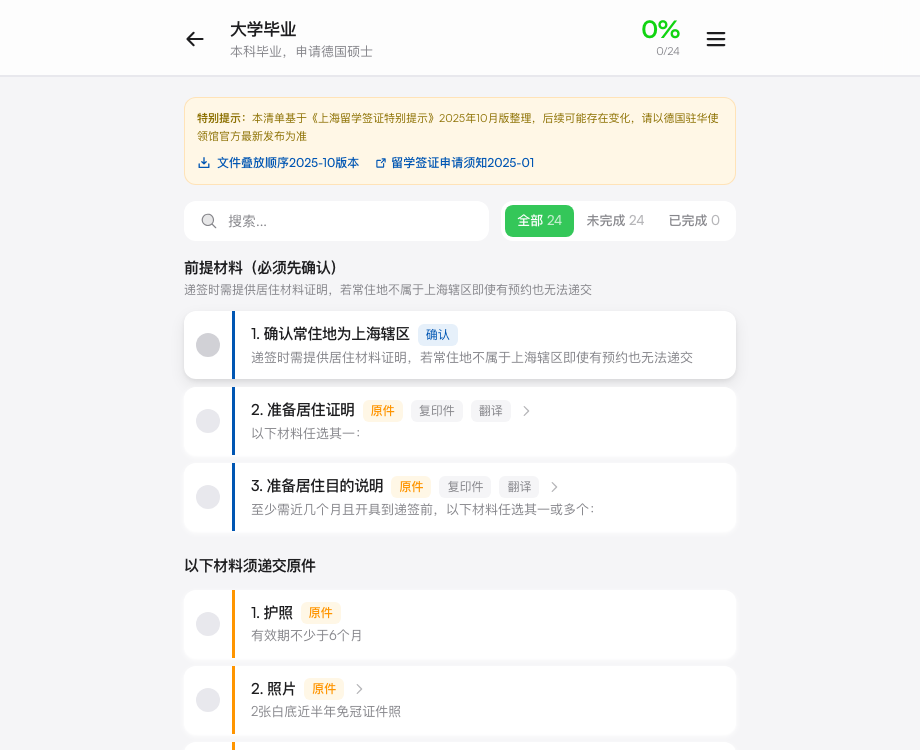

# 德国留学签证材料清单

帮助在上海办理德国留学签证的学生准备申请材料的桌面应用。

## 应用截图

| 角色选择页面 | 材料清单页面 |
|:---:|:---:|
|  |  |

## 功能特点

- **角色选择** - 根据学历背景（大学在读/毕业/硕士在读/硕士毕业）显示对应清单
- **材料清单** - 严格按照德国驻上海总领事馆官方要求整理
- **进度追踪** - 勾选标记材料准备状态，实时显示完成进度
- **搜索功能** - 快速搜索特定材料
- **标签提示** - 显示原件、复印件、翻译等材料类型标签
- **数据持久化** - 关闭应用后保留勾选状态
- **导入/导出** - 支持导出 Excel 和从 Excel 导入数据

## 技术栈

- [Tauri](https://tauri.app/) v2 - 桌面应用框架
- [React](https://react.dev/) 18 - UI 框架
- [TypeScript](https://www.typescriptlang.org/) - 类型安全
- [Tailwind CSS](https://tailwindcss.com/) - 样式框架
- [Zustand](https://zustand-demo.pmnd.rs/) - 状态管理
- [Framer Motion](https://www.framer.com/motion/) - 动画

## 安装

### 从 Release 下载

前往 [Releases](https://github.com/leoomo/german_visa_app_materialschecklist/releases) 页面下载最新版本的安装包。

### 自行构建

```bash
# 克隆项目
git clone https://github.com/leoomo/german_visa_app_materialschecklist.git
cd visa-checklist

# 安装依赖
npm install

# 开发模式
npm run dev

# 构建桌面应用
npm run tauri build
```

## 使用说明

1. 选择您的学历背景（大学在读/毕业/硕士在读/硕士毕业）
2. 查看对应的签证申请材料清单
3. 勾选已准备好的材料
4. 关注顶部进度条，了解整体准备情况

## 数据来源

- 《上海留学签证特别提示》2025年10月版
- [德国驻华使领馆官方网站](https://china.diplo.de/cn-zh/service/visa-einreise/nationales-visum-fuer-studium)

## 致谢

- 德国驻上海总领事馆签证处
- [Phosphor Icons](https://phosphoricons.com/) - 图标库
- [Fontshare](https://www.fontshare.com/) - 字体 (Satoshi, Cabinet Grotesk)

## 开源许可

本项目基于 [MIT](./LICENSE) 许可证开源。

---

*本清单仅供参考，请以德国驻华使领馆官方最新发布为准。*
