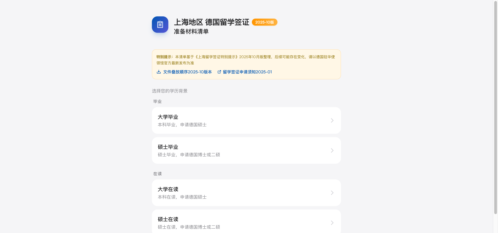
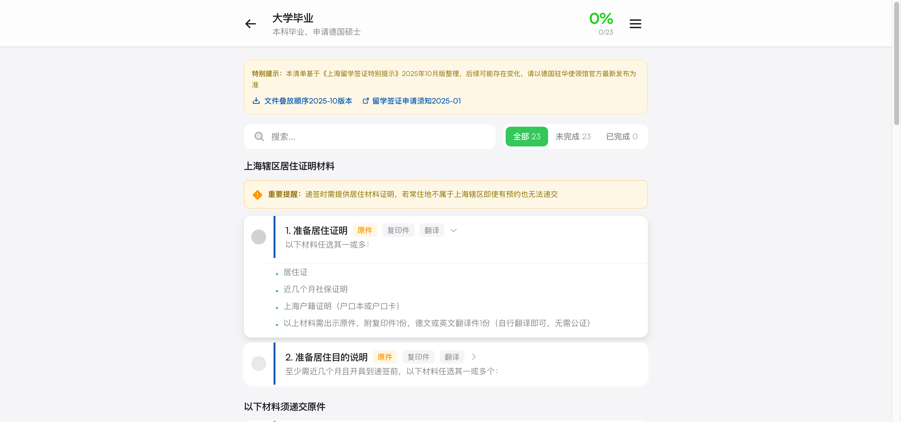

# German Student Visa Materials Checklist

<p align="center">
  <a href="README.md">:uk: English</a> |
  <a href="README.zh.md">:cn: 中文</a>
</p>

A desktop application helping students in Shanghai prepare German student visa application materials.

## Screenshots

| Role Selection | Checklist |
|:---:|:---:|
|  |  |

## Features

- **Role Selection** - Display corresponding checklist based on academic background (Bachelor in progress/graduated, Master in progress/graduated)
- **Materials Checklist** - Organized strictly according to official requirements from German Consulate General Shanghai
- **Progress Tracking** - Check off prepared materials with real-time completion progress
- **Search** - Quickly search for specific materials
- **Type Labels** - Display labels for originals, copies, translations, etc.
- **Data Persistence** - Checked items are preserved after closing the app
- **Import/Export** - Support exporting to Excel and importing from Excel

## Tech Stack

- [Tauri](https://tauri.app/) v2 - Desktop framework
- [React](https://react.dev/) 18 - UI framework
- [TypeScript](https://www.typescriptlang.org/) - Type safety
- [Tailwind CSS](https://tailwindcss.com/) - Styling
- [Zustand](https://zustand-demo.pmnd.rs/) - State management
- [Framer Motion](https://www.framer.com/motion/) - Animations

## Installation

### Download from Release

Go to [Releases](https://github.com/leoomo/german_visa_app_materialschecklist/releases/latest) page to download the latest version:

- **macOS**: Download `_aarch64.dmg` (Apple Silicon)
- **Windows**: Download `_x64-setup.exe`

### Build from Source

```bash
# Clone repository
git clone https://github.com/leoomo/german_visa_app_materialschecklist.git
cd visa-checklist

# Install dependencies
npm install

# Development mode
npm run dev

# Build desktop app
npm run tauri build
```

## Usage

1. Select your academic background (Bachelor in progress/graduated, Master in progress/graduated)
2. View the corresponding visa application materials checklist
3. Check off materials you have prepared
4. Monitor the progress bar at the top for overall preparation status

## Data Sources

- "Shanghai Student Visa Special Notice" October 2025 Edition
- [German Embassy/Consulates in China Official Website](https://china.diplo.de/cn-zh/service/visa-einreise/nationales-visum-fuer-studium)

## Acknowledgements

- Visa Section, German Consulate General Shanghai
- [Phosphor Icons](https://phosphoricons.com/) - Icon library
- [Fontshare](https://www.fontshare.com/) - Fonts (Satoshi, Cabinet Grotesk)

## License

This project is open-sourced under the [MIT](./LICENSE) license.

---

*This checklist is for reference only. Please refer to the latest official release from German Embassy/Consulates in China.*
